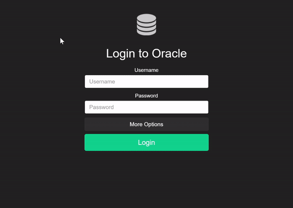

A simple database interfacing application using Node.js, Electron and React.js.

## Installation
Run `npm install`

## Running Application

Run `npm run electron`

## Running While Developing

Run `npm run dev`

**Oracle login will not work in the browser due to a lack of Node.js presence - use the electron app!**